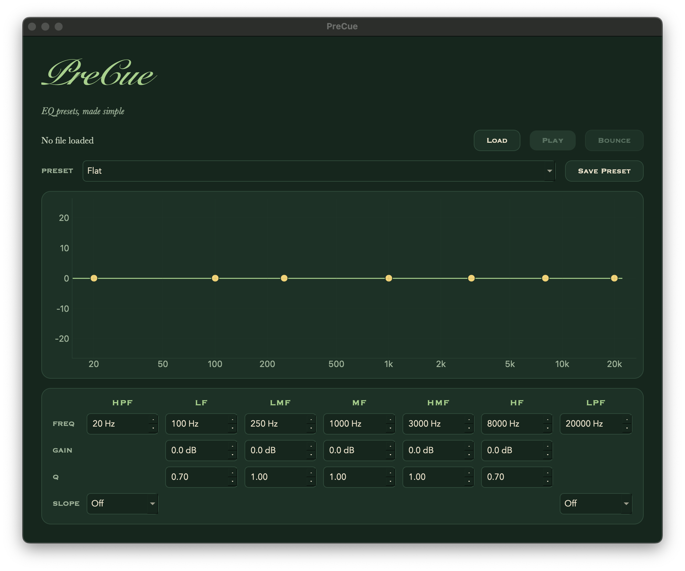

# PreCue

**EQ presets for people who don't live in a DAW.**

PreCue is a desktop EQ app built for musicians and beginners who want their tracks to sound better without learning a full digital audio workstation. Load a track, pick a preset for your instrument, hear the difference live, and bounce it out.



## Features

- **Live playback:** load an audio file and hear EQ changes in real time while it plays
- **7-band EQ** modeled after the Pro Tools EQ3 layout: HPF, LF shelf, LMF, MF, HMF, HF shelf, and LPF
- **Selectable filter slopes** for the HPF and LPF (Off, 6, 12, 18, 24 dB/oct)
- **Live EQ curve** that redraws as you change any value
- **Built-in instrument presets:** Vocals, Kick, Snare, Bass, Acoustic Guitar, Electric Guitar, Piano
- **Custom presets:** save your own settings and load them anytime
- **Bounce** the processed track to a new WAV file

## How it works

PreCue is built on Spotify's [pedalboard](https://github.com/spotify/pedalboard) library for audio processing.

- **Real-time EQ:** audio is fed to the sound card in small chunks. Each chunk runs through the current EQ chain before it plays, so changing a setting affects the very next chunk.
- **Accurate EQ curve:** instead of estimating the curve with filter math, PreCue sends a single impulse through the actual EQ chain and measures the output with an FFT. The graph always matches exactly what you hear.
- **Filter slopes:** steeper HPF/LPF slopes are built by stacking 6 dB/oct filters.
- **Presets** are stored as JSON files, so they're easy to read, edit, and share.

## Installation

Requires Python 3.10 or newer.

```bash
git clone https://github.com/TarunKancharla/PreCue.git
cd PreCue
python3 -m venv venv
source venv/bin/activate
pip install -r requirements.txt
```

## Usage

```bash
python app.py
```

1. Click **Load** and choose a WAV, MP3, AIFF, FLAC, or M4A file
2. Click **Play**
3. Pick a preset from the dropdown, or adjust the bands yourself
4. Click **Save Preset** to keep your own settings
5. Click **Bounce** to export the result as a WAV

## Project structure

```
PreCue/
├── app.py            # GUI: window, controls, graph
├── engine.py         # EQ chain, file loading, bouncing, frequency response
├── player.py         # Real-time playback
├── presets.py        # Loading and saving presets
├── make_presets.py   # Generates the built-in presets
├── style.py          # Colors and stylesheet
└── presets/          # Built-in preset JSON files
```

## Built with

- [pedalboard](https://github.com/spotify/pedalboard): audio processing
- [PySide6](https://doc.qt.io/qtforpython/): GUI
- [pyqtgraph](https://www.pyqtgraph.org/): EQ curve display
- [sounddevice](https://python-sounddevice.readthedocs.io/): audio playback
- [NumPy](https://numpy.org/): audio data and FFT

## About

Built by Tarun Kancharla, Computer Science and Music at Northeastern University.